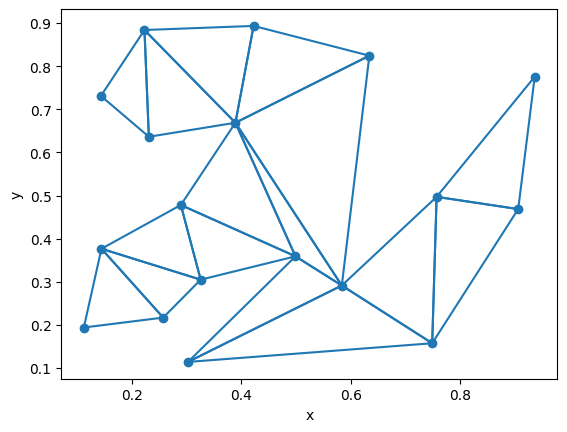
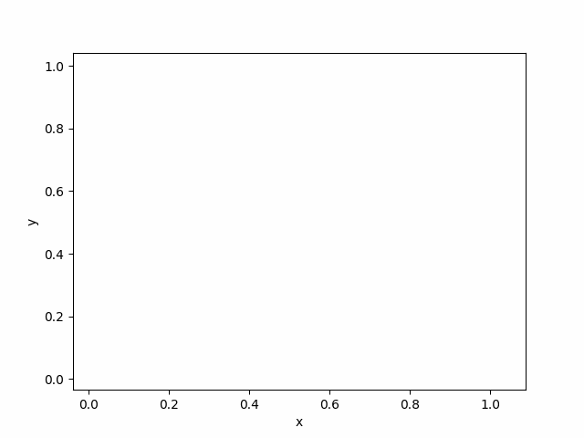

# Constrained_Delaunay_Triangulation

## Table of contents
- [Introduction](#introduction)
- [Installation](#installation)
- [Usage](#usage)
- [Visualization](#visualization)
- [License](#license)

## Introduction
This project provides implementation and visualization of
construction of a Constrained Delaunay Triangulation
in Python, in form of a Jupyter Notebook.




## Installation
To install the necessary dependencies, run:

```sh
pip install -r requirements.txt
```


## Usage
1. Open 'Constrained_Delaunay_Triangulation.ipynb' (e.g. in Jupyter Notebook, PyCharm or VS Code)
2. Follow the instructions in the notebook cells.


## Visualization
Visualization is made using *visualizer* provided by the [_BIT Scientific Group_](https://github.com/aghbit/Algorytmy-Geometryczne).
It allows for both images of the final construction and step by step visualization in form of a gif.



## License
This project is licensed under the MIT License. See the [LICENSE](LICENSE) file for details.